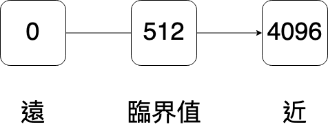

# Lesson 4: Anti-Collision System

## [拼砌教學](https://www.artec-kk.co.jp/school/cl/textbooks/material_en/topic_4-2/4-2_build_E.pdf)

## 超聲波感應器

```python
from pystubit.board import buzzer
from pyatcrobo2.parts import DCMotor, UltrasonicSensor
import time

us = UltrasonicSensor('P0')
dcm = DCMotor('M1')
dcm.power(100)

def alarm():
    for i in range(3):
        buzzer.on('C7',duration=50)
        time.sleep_ms(50)

while True:
    value = us.get_distance()
    print(value)
    if value > 0 and value < 10:    # Sounding the Alarm
        alarm()
    if value < 5:   # Automatic Braking
        dcm.brake()
    else:
        dcm.cw()
```

## 紅外線感應器

```python
from pystubit.board import buzzer
from pyatcrobo2.parts import DCMotor, IRPhotoReflector
import time

ir = IRPhotoReflector('P0')
dcm = DCMotor('M1')
dcm.power(100)

def alarm():
    for i in range(3):
        buzzer.on('C7',duration=50)
        time.sleep_ms(50)

while True:
    value = ir.get_value()
    print(value)
    if value > 256:   # Sounding the Alarm
        alarm()
    if value > 512:   # Automatic Braking
        dcm.brake()
    else:
        dcm.cw()
```


